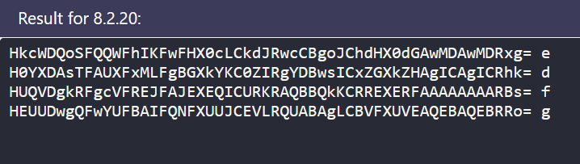

## Natas 11 walkthrough

First, after we put the correct credentials, the first thing we see here is this image:


There are two things that are very useful in this frontend page, the first one is that they are telling us that they page is using XOR encryption for the cookies, and the second one, is that we can take a look at the sourcecode. 
So we are going to take a look at the cookies, and we find that there is one named data, and has the following value. 


and then we take a look at the source code


we see that there is a variable called *defaultdata*, this variable contains two values, the most important one is *showpassword*, then we have a xor_encrypt function, and we can that the see $key variable is censored, so from this we can infere that we have to guess the key, in some way, we will see how later on!
And then we have another two function called *loadData* and *saveData*. The first one takes the array, and then decrypts the data, using base64_decode, xor_encrypt and json_decode, then it does some questions about the content of the array, and finally returns the data decoded.
The last one encodes the data in the array, as saves it in the cookies variable called *data*.

From the logic of this code, we can see that the page first loads the data from the cookies, then ask a question about the array, and finally it encrypts the array information. 
And then, in the html page, we can see that the cookies has a *yes* value in the variable *showpassword*, then the page will show the password to next level of natas, and that is the one password that we are looking for after all. 

So mainly what we have to do is: Guess the key, and then change the value of the array to yes.

### Guessing the key
This part is the good one, because we have to think with what we can work. The first thing to notice is that, we have a value in the cookies, that it was generated after the encryption, and also, we know what variable was transformated, yes you guessed it, the *defaultdata* variable!
So with this in mind, to guess the key, we will use brute force until we can find a key that generates the data stored in the cookies. Let's cook. 

```php
$cookie = 'HmYkBwozJw4WNyAAFyB1VUcqOE1JZjUIBis7ABdmbU1GIjEJAyIxTRg%3D';

$defaultdata = array( "showpassword"=>"no", "bgcolor"=>"#ffffff");

$letters = "qwertyuiopasdfghjklzxcvbnmQWERTYUIOPASDFGHJKLZXCVNBM";

for ($i=0 ; $i< strlen($letters); $i++){
	$data =  base64_encode(xor_encrypt(json_encode($defaultdata),$letters[$i]));
	if ($cookie[0] == $data[0] ){
		echo $data;
		echo " ";
		echo $letters[$i];
		echo "\n";
}}
```
After we run the php code above, we see the following output:

Looking at the output, we can clearly see that there are four candidates to be the first letter of the key, so to find out who is the right one, we will use brute force to find it.

eDWo is the key
### Changing the value