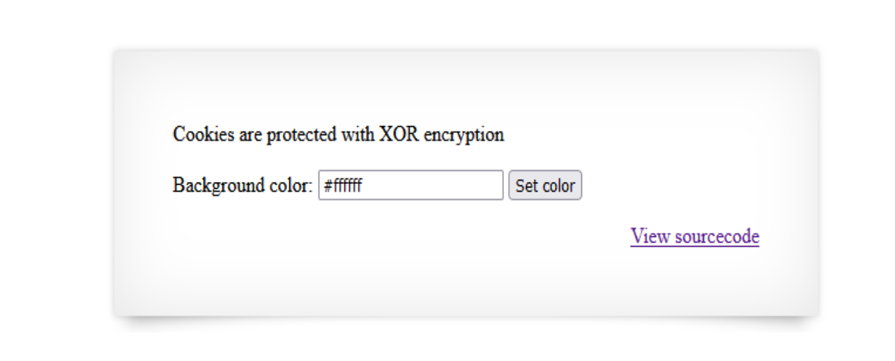
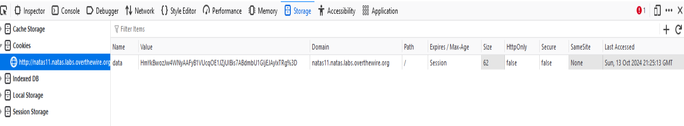
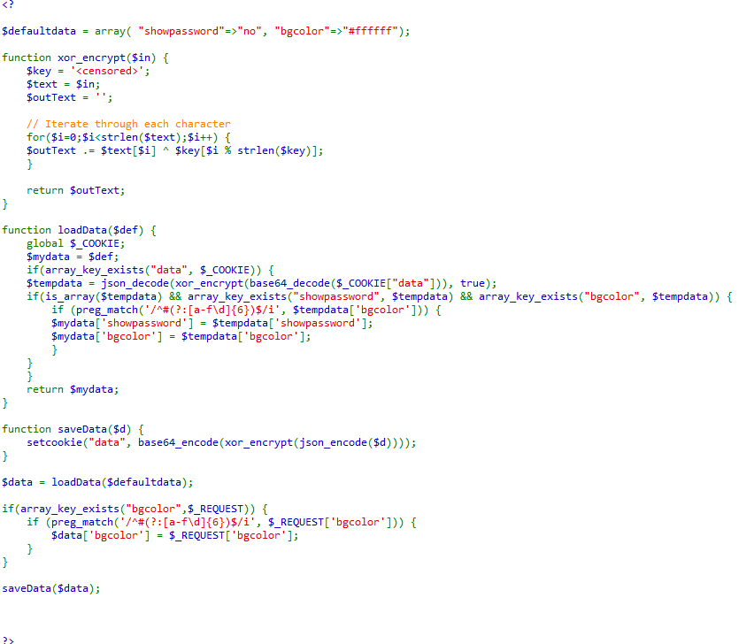
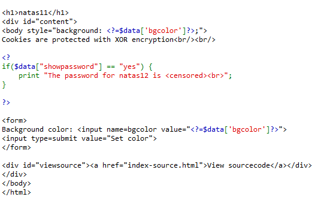
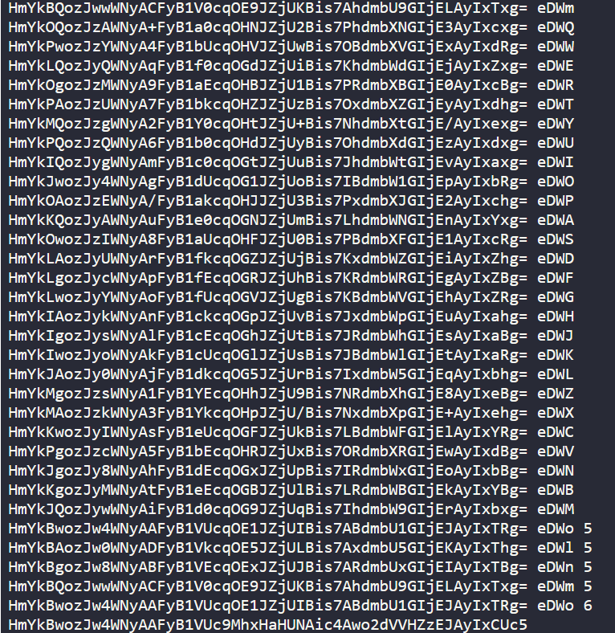
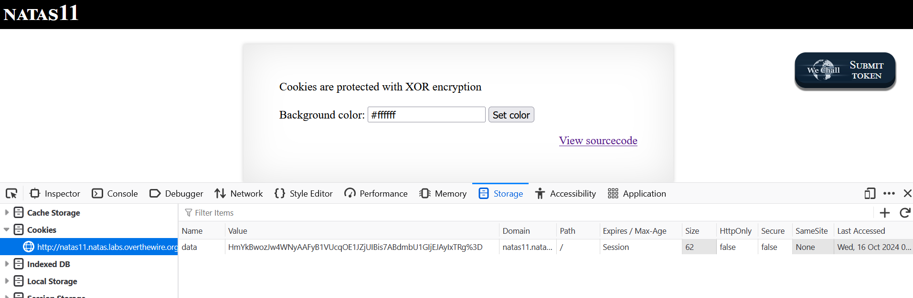
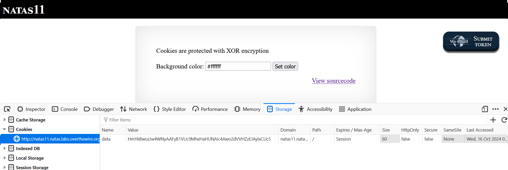
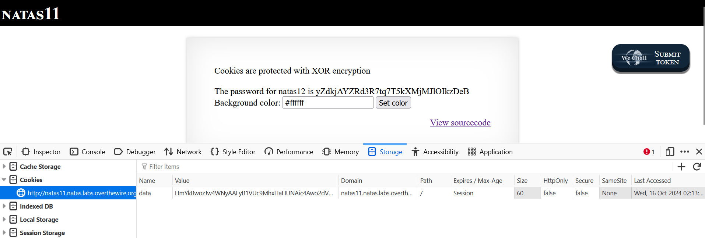

## Natas 11 walkthrough

First, after we put the correct credentials, the first thing we see here is this image:


There are two things that are very useful in this frontend page, the first one is that they are telling us that they page is using XOR encryption for the cookies, and the second one, is that we can take a look at the sourcecode. 
So we are going to take a look at the cookies, and we find that there is one named data, and has the following value. 


and then we take a look at the source code



we see that there is a variable called *defaultdata*, this variable contains two values, the most important one is *showpassword*, then we have a xor_encrypt function, and we can that the see $key variable is censored, so from this we can infere that we have to guess the key, in some way, we will see how later on!
And then we have another two function called *loadData* and *saveData*. The first one takes the array, and then decrypts the data, using base64_decode, xor_encrypt and json_decode, then it does some questions about the content of the array, and finally returns the data decoded.
The last one encodes the data in the array, as saves it in the cookies variable called *data*.

From the logic of this code, we can see that the page first loads the data from the cookies, then ask a question about the array, and finally it encrypts the array information. 
And then, in the html page, we can see that the cookies has a *yes* value in the variable *showpassword*, then the page will show the password to next level of natas, and that is the one password that we are looking for after all. 

So mainly what we have to do is: Guess the key, and then change the value of the array to yes.

### Guessing the key
This part is the good one, because we have to think with what we can work. The first thing to notice is that, we have a value in the cookies, that it was generated after the encryption, and also, we know what variable was transformated, yes you guessed it, the *defaultdata* variable!
So with this in mind, to guess the key, we will use brute force until we can find a key that generates the data stored in the cookies. Let's cook. 

```php
$cookie = 'HmYkBwozJw4WNyAAFyB1VUcqOE1JZjUIBis7ABdmbU1GIjEJAyIxTRg%3D';

$defaultdata = array( "showpassword"=>"no", "bgcolor"=>"#ffffff");

$letters = "qwertyuiopasdfghjklzxcvbnmQWERTYUIOPASDFGHJKLZXCVNBM";

$first_candidates = [];

for ($i=0 ; $i< strlen($letters); $i++){
	$data =  base64_encode(xor_encrypt(json_encode($defaultdata),$letters[$i]));
	if ($cookie[0] == $data[0] ){
		echo $data;
		echo " ";
		echo $letters[$i];
		$first_candidates[] = $letters[$i];
		echo "\n";
	}
}
```
The code above, is useful because with that for loop we will find the first candidates of the key, if a letter doesn't match the first character of the cookie, we will discard it.
Then we have the following part of the code 
```php

$temp = [];
$contador = 2;
$found_key = false;
while($contador < 5 || count($temp)!=1) {
	$temp = [];
	for($k=0; $k < count($first_candidates); $k++){
		if($contador<5){
			for ($i=0 ; $i< strlen($letters); $i++){
				$key = $first_candidates[$k].$letters[$i];
				$data =  base64_encode(xor_encrypt(json_encode($defaultdata),$key));
				if (substr($cookie,0,$contador)==substr($data,0,$contador) ){
					echo $data;
					echo " ";
					echo $key;
					$temp[] = $key;
					echo "\n";
				}
			}
		}
		else{
			$found_key = true;
			$key = $first_candidates[$k];
			$data =  base64_encode(xor_encrypt(json_encode($defaultdata),$key));
			if (substr($cookie,0,$contador)==substr($data,0,$contador) ){
				echo $data;
				echo " ";
				echo $key;
				echo " ";
				echo $contador;
				$temp[] = $key;
				echo "\n";
				$best_match = $key;
			}
		}
	}
	if($found_key == false) {
		$first_candidates = $temp;
	}

	$contador++;
}
```
I know is a lot to cover, but bear with me. First we declare some variables to store important information, *temp* will be use to store the list of keys, *contador* will be use to move the "pointer" of the two strings, and lastly *found_key* is a flag. 
The condition for the while loop is quite simple, if the length of the temp array is one, it means that it found the key, and why contador has to be less than 5? I'll explained it later. Then inside the while loop we have brute force!  
First we have a double for loop, that will generate all the possibles keys candidates and see if the encrypted data generated matches at least a substring of the cookie. And we will print the values for clarity. When contador is greater than 5, we can have a situation where we have more than one candidate to be the key, so to find out who is the real one, we will only focus on incrementing the *contador* variable until they temp array only has one element. And also we set *found_key* variable to be true, so the variable *first_candidates*, that nows stores the finals_candidates, doesn't lose the needed data. 

And now, that we know that we found the real key, we will just simply modify the array, so when we put this new cookie in the storage, it will show us the password.

```php
$defaultdata = array( "showpassword"=>"yes", "bgcolor"=>"#ffffff");
echo  base64_encode(xor_encrypt(json_encode($defaultdata),$best_match));
```

And this is the final part of the output: 



### Changing the value
So know that we found the key, we will change the value store in the cookies for this one HmYkBwozJw4WNyAAFyB1VUc9MhxHaHUNAic4Awo2dVVHZzEJAyIxCUc5, lets see what happens!





We changed the value of the data cookie, so what will happen when we recharge the web browser???



voilá, we found the password!! It's was a really intertaining exercise.
Now one thing that I must declare is that, the value of contador was found by inspection, what I meand with this is that, in my first try I constructed the key by hand, to say in a way, because when I found the candidates, I was seeing which one matched the original cookie, and then started to add the real characters, and so on, and when I reach the four letters, the match was perfect. 
That's all I have to say, if you reached this far, thanks you so much for your time, hope you learned something new while reading.