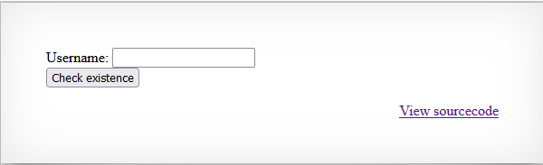
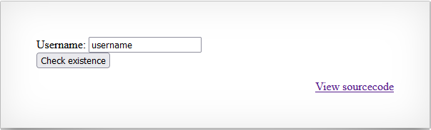
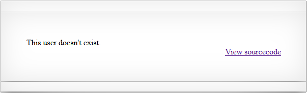
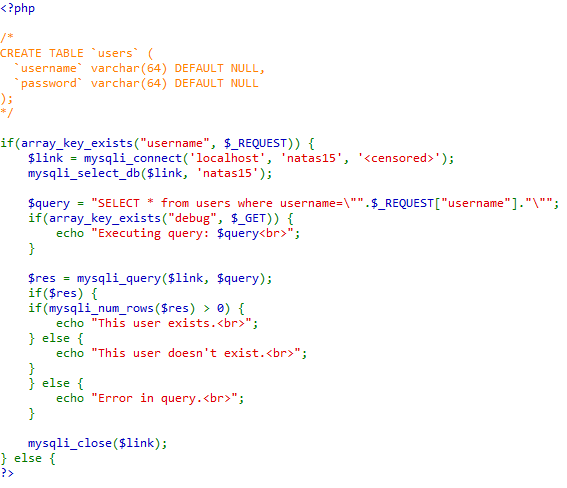
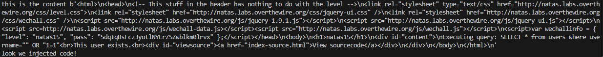

# Natas 15 walkthrough
As always, we first introduce our credentials, and the first thing we see is this:

We see a form, that ask us to introduce an username, and then when we click the check existence button to send the post request. Lets try to introduce a random name, like 'username'

We get redirected to the following page 

An as a result, the we see the text "This user doesn't exist.", this will be useful later in the script. 
So from what we have gathered by now, we can guess that if we put an username that exists, maybe the text that appears will be different.

Still we don't have much information, so we will see the source code.
 
And looking at it, we see two important things, someone left the schema of the database in a comment, and we see that they are using a query. And another thing that is useful that we have a debug variable that we can add in the request, so we can see the query generated. 

To solve this problem, we can divide it the following parts: Code injection, finding the usernames, 
finding the password.

## Code Injection

For me at least, this was the part that took more time, because to create the query, I had to use my imagination and creativity. And also have to find a way to confirm that I can inject code.

### Confirming the code injection
To see if it's possible to inject code into this form, I created this function to help me (Before you look at it, you could try it for yourself!).
```python
#Function to see if we can inject code
def test_code_injection():
    payload = {'debug':'True','username': "\" OR \"1=1" }
    r= session.post(url,auth=(username, password),data=payload)
    print(f"this is the content {r.content}")
    if b"This user exist" in r.content:
        print(f"look we injected code!")
```
I set the debug variable to true, because it's helpful, and used an old friend (" OR "1=1) to verify if it's possible to inject code, and also left a print of the content, because when I was trying to write our old friend, I've made a lot of syntaxs errors, so it did not worked out at the first try hahaha. And it finally worked as you can see in this output.


### Creating the query
